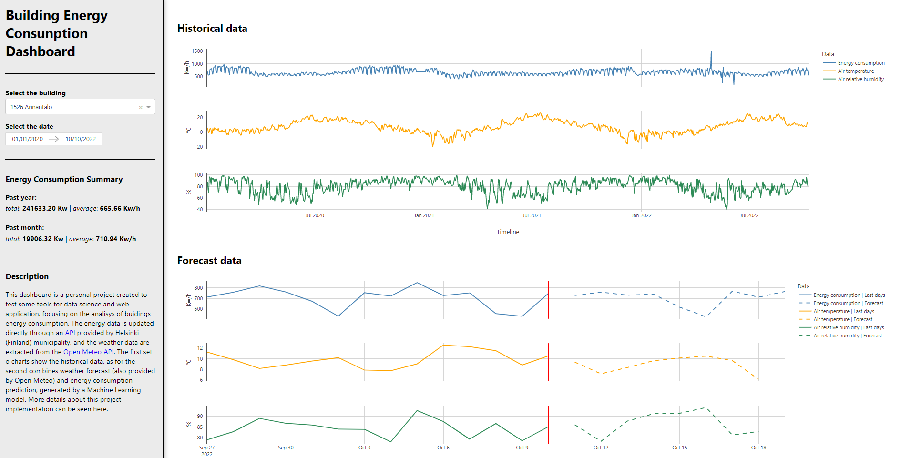

Versão em [português](#pt-br)

# Building Energy Consumption Dashboard

--> [Link to the app](https://building-energy-dashboard.onrender.com)

This dashboard is a portfolio project created to develop and showcase skills on tools for data science and web application, focusing on the analysis of buildings energy consumption. The energy data is updated directly through an [API](https://helsinki-openapi.nuuka.cloud/swagger/index.html#/) provided by Helsinki (Finland) municipality, and the weather data are extracted from the [Open Meteo API](https://open-meteo.com/). The first set o charts show the historical data, as for the second combines weather forecast (also provided by Open Meteo) and energy consumption prediction, generated by a Machine Learning model. 

## Skills developed in this process

- Working with real-world data and API connections with Requests; 
- Data visualization with Plotly;
- Dashboard creation with Dash;
- A few principles of software design on the Dash code;
- Time series machine learning with Darts;
- Basic MLOps with FastAPI, Docker and Render.com;
- Dash App deploy with Render.com.

## Limitations

This dashboard was deployed in Render.com flee plans, so it has some performance limitations. Keep in mind that, while interacting with the application, the charts may take a little time to update. Wait until the building location in the charts title are the same as the one selected in the dropdown menu.

## Machine Learning Model

The model used for this project is a LighGBM model trained through the Darts library, using Python. I created an API that communicates with the dashboard, so that the model can be updated separetely. It is in another repository and you can find more information [here](https://github.com/brunoperdigao/Building-Energy-ML-API).

## Motivations

I'm an architect and have been designing buildings for over 10 years now. In face of all the environmental challenges that we've been going through in our planet, one of the key responsibilities in the AEC (architecture, engineering and construction) field is to create more sustainable buildings and create ways to make them more efficient in energy consumption. As a designer there are a set of concepts that we use to achieve that, like solar path study and passive design strategies. However, most of the time this work is done empirically, with no data collected after the building is completed. That search for a more data-driven approach led me to start learning Data Science, that has a great usage for sustainability and energy efficiency in buildings.

Nowadays, there is great technology available to measure lots of information about buildings. This project tries to achieve an example of how Data Science can be used in the AEC field, by helping to monitor the buildings data and using weather forecast data to help predict the building energy consumption. With that knowledge, the building operators are able to make decisions and create strategies to improve how the energy is used in that building and make it more efficient.

---

# Dashboard de Consumo Energético em Edificações
link para o app: https://building-energy-dashboard.onrender.com

'Este dashboard é um projeto para portfólio, criado com o intuito de desenvolver e demonstrar habilidades em ferramentas de ciência de dados para criação de aplicações web, com foco na análise de consumo energético de edificações. Os dados de energia são atualizados diretamente por uma [API](https://helsinki-openapi.nuuka.cloud/swagger/index.html#/) fornecida pela prefeitura de Helsinki (Finlândia), e os dados climáticos são extraídos da [API Open Meteo](https://open-meteo.com/). O primeiro conjunto de gráficos mostra os dados históricos, enquanto o segundo agrega dados de previsão climática (retirados da mesma API Open Meteo), com dados de previsão de consumo energético gerados a partir de um modelo de Machine Learning.
## Habilidades desenvolvidas
- Trabalhando com dados reais e conexão com API com Requests;
- Visualização de dados com Plotly;
- Criação de dashboard com Dash;
- Alguns princípios de design de software no código do Dash;
- Machine Learning para séries temporais com Darts;
- MLOps básico com FastAPI, Docker e Render.com;
- Deploy do aplicativo Dash com Render.com.

## Limitações
Esse dashboard foi implantado no Render.com utilizando o plano gratuito, portanto com alguma limitação de desempenho. Note que, durante a interação com a aplicação, os gráficos podem levar um tempo para serem atualizados. Aguarde até que a localização do edifício no título dos gráficos esteja igual ao que foi selecionado no menu.

## Modelo de Aprendizagem de Máquina

O modelo utilizado neste projeto é um modelo LightGBM treinado a partir da biblioteca Darts, utilizando Python. Eu criei um API que se comunica com o dashboard, para que o modelo possa ser atualizado separadamente. Ele está em outro repositório e você pode encontrar mais informações [aqui](https://github.com/brunoperdigao/Building-Energy-ML-API).

## Motivações

Eu sou arquiteto e trabalho com projeto de edificações por mais de 10 anos. Frente aos desafios ambientais pelos quais estamos passando no nosso planeta, uma das principais responsabilidades no campo da AEC (arquitetura, engenharia e construção) é criar mais edifícios sustentáveis e criar maneiras de fazê-los mais eficientes em relação ao seu consumo energético. Como projetista, existem uma série de conceitos que utilizamos para conseguir esse objetivo, como estudos solares e estratégias passivas de projeto. No entanto, geralmente esse trabalho é feito de forma empírica, sem uma coleta de dados após o edifício estar em uso. Essa busca por uma abordagem focada em dados me levou a aprender sobre Ciência de Dados, que tem um uso bem interessante para sustentabilidade e eficiência energética das edificações.

Hoje em dia, existe boa tecnologia disponível para medição de várias informações de uso de um edifício. Esse projeto busca demonstrar um exemplo de como a Ciência de Dados pode ser usada no campo da AEC ajudando a monitorar os dados das edificações e utilizando dados de previsão do tempo para ajudar a prever o consumo energético da edificação. Com esse conhecimento, os operadores podem tomar decisões e criar estratégias para melhorar o uso da energia naquele prédio e melhorar sua eficiência.

